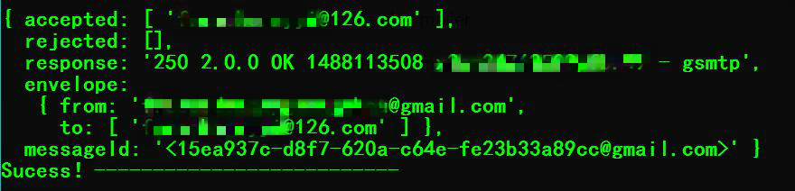
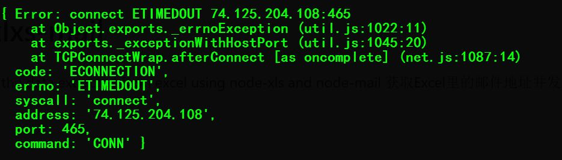

# Node-xlxs-mail

Send mail with data extracted from excel   获取Excel里的邮件地址并发送邮件

  >This script helped me send out 50 mails to inform those who registered freecodecamp meetup activities yesterday within 10 mins (Take so long time just because of TIMEOUT issues for `ping mail.google.com` problem : )
  >Here is an <a href="http://www.jianshu.com/p/7a35fa90810f">article-CN</a> associated this project .
  
# Modules
  - nodemailer
  - node-xlsx 
  - log4js

# Features

  - You can easily to send mails to those email address stored in excel
  - You can review the logs to check the status

####Success 
<br>
####Error - ETIMEOUT
<br>

>####Note
>I use google smtp service to send mails, obiviously the network is not stable in CN /* you can use `ping mail.google.com` to check */,so the programme will hit the issue  `ETIMEOUT ==> Error Timeout` sometimes,you can try to login on google mail with web browser(work for me) or use other smtp service (such as mailgrid,mailgun,qq.etc.) 

# Preparation
- update emailAddress info or replace **test.xlxs** in root path
- update **src/parseExcel.js** with current excel name or specify the column stored e-mail address 
- update **src/mailContext.js**  with your own mail smtp service 

```
├── index.js
├── log4js_confg.json
├── test.xlsx        **replace your excel with email-address**
├── package.json
├── .gitignore
├── README.md
├── src
│ ├── mailContext.js **update your mail-info : your smtp mail service info**
│ ├── parseExcel.js  **update excel name if excel is not named 'test.xlxs' & specify email column**
├── logs
│ ├── logs...
├── img
│ ├── imgs... 

```

# Build
``` bash
# install dependencies
npm install

# run the script
node index.js

```

# ToDo
- Work out a better solution to handle ETIMEOUT issue.
- Fetch the list of return/blocked mails

~(≧▽≦)/~ Encourage me a start🌟 if you like it~(≧▽≦)/<br>
~(≧▽≦)/~  如果有那么一丁点儿喜欢 请随手🌟~(≧▽≦)/~啦啦啦 

